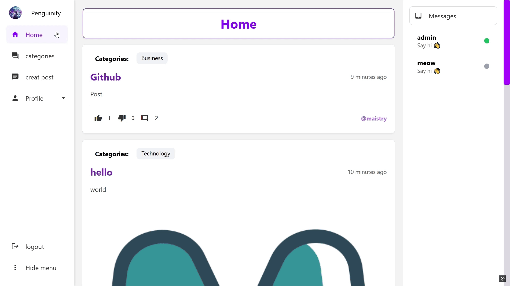
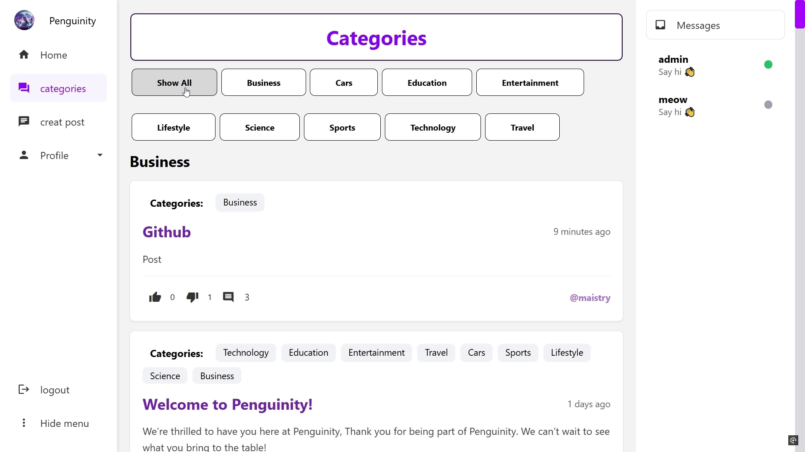

# Real-Time Forum

A comprehensive web forum application built with Go, JavaScript, SQLite, and Docker. The application enables real-time communication, content sharing, and user interaction in a secure environment.

## Application Preview

### Home & Posts

*Interactive post commenting and engagement*

### Categories & Navigation

*Category filtering and organization*

### User Data

*Profile management*

### Post Creation

*Creating new posts with rich content*

### Real-Time Chat

*Real-time messaging between users*

## Features

### User Authentication & Roles
- **Guest Users**
  - View-only access to forum content
  - Limited functionality
- **Normal Users**
  - Post creation and management
  - Commenting capabilities
  - Like/dislike interaction
- **Moderator Users**
  - All normal user privileges
  - Post deletion capabilities
  - Report submission to administrators
- **Administrator Users**
  - User role management
  - Category management
  - Report handling
  - Full content moderation

### Real-Time Communication
- **WebSocket Integration**
  - Live chat functionality
  - Real-time notifications
  - Online status indicators
  - Instant message delivery
- **Chat Features**
  - Private messaging between users
  - Message status indicators
  - Chat history preservation
  - Emoji support

### Content Management
- **Posts**
  - Category association
  - Image attachment support
  - Comment threading
- **Interactions**
  - Like/dislike system
  - Comment responses
  - Category filtering

### Security Features
- **Rate Limiting**
  - User-based restrictions
  - IP-based blocking
- **Secure Communications**
  - HTTPS implementation
  - Password hashing (bcrypt)
- **Session Management**
  - Secure cookie handling
  - User session tracking
- **Advanced Security**
  - XSS protection
  - CSRF prevention
  - SQL injection protection
  - Input sanitization
  - Rate limiting with IP tracking
  - Secure file upload validation

### Responsive Design
- Single-page application
- Real-time updates
- Category-based navigation
- User activity tracking

## Technical Stack
- Go (Backend)
- JavaScript (Frontend)
- SQLite (Database)
- Docker (Containerization)
- WebSocket (Real-time Communication)

## Setup Instructions
1. Clone the repository:
```bash
git clone https://learn.reboot01.com/git/musabt/real-time-forum.git
cd RTF
```

2. Build Docker image:
```bash
docker build -t RTF-app .
```

3. Run container:
```bash
docker run -p 443:443 RTF-app
```

4. Access application:
- Open browser
- Navigate to https://localhost

## Authors
- [@Mujtaba AKA:MAISTRY](https://github.com/maistry)
- [@Mahmood AKA:M2y0](https://github.com/m2y0)